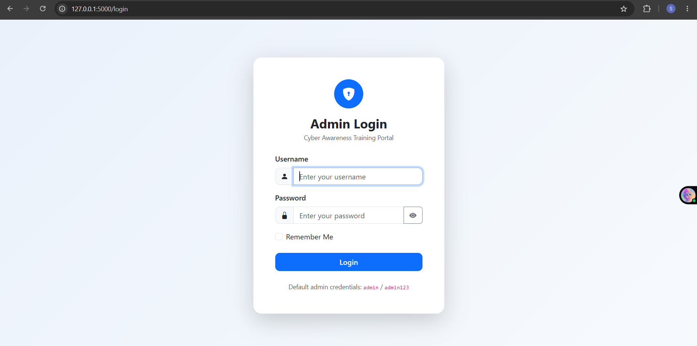
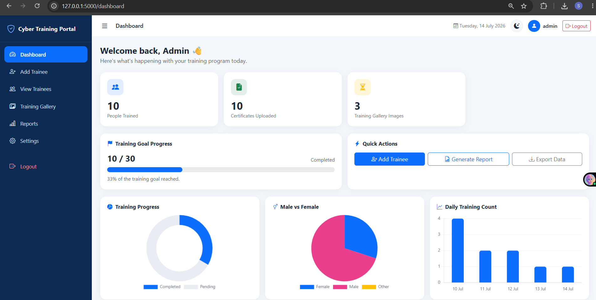
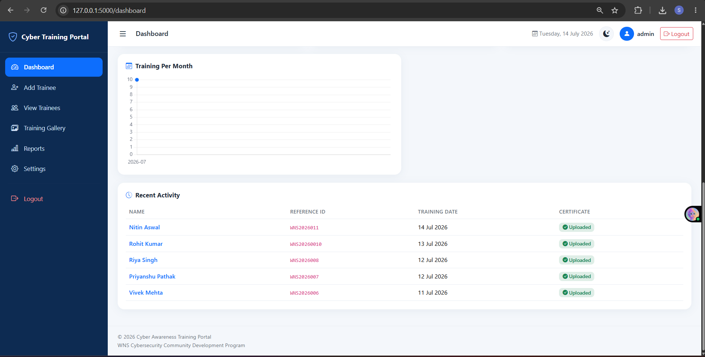
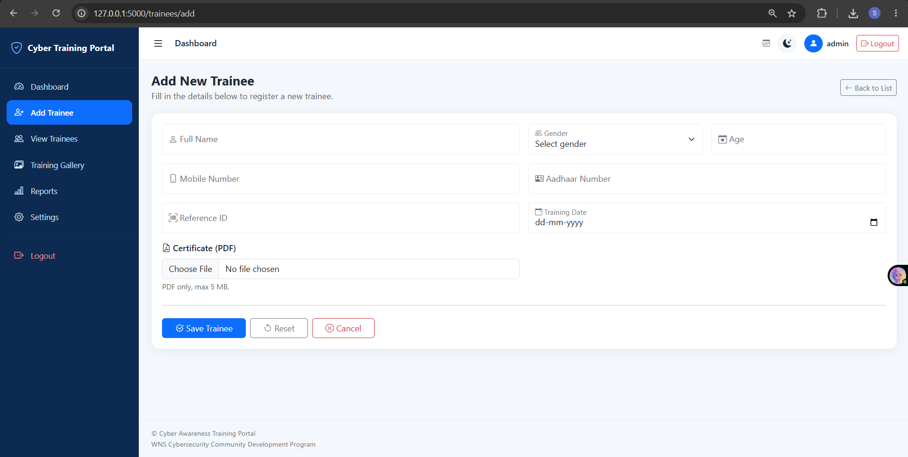
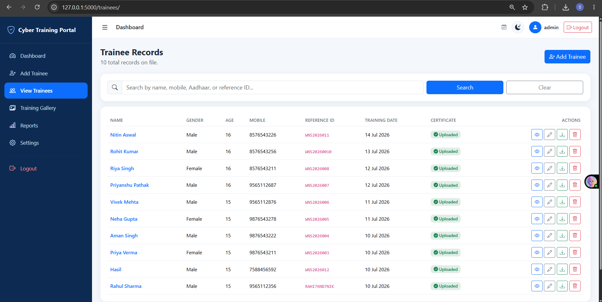
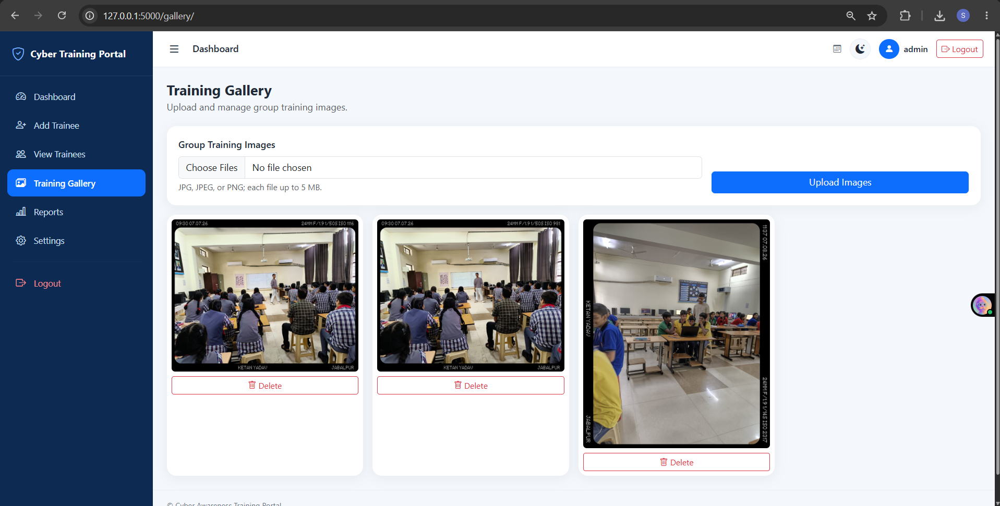
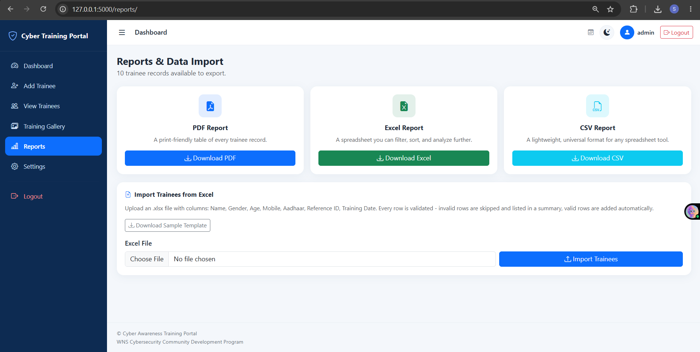
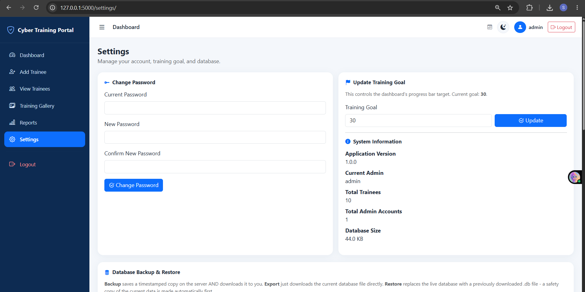

# Cyber Awareness Training Portal

**Version 1.0** — A production-ready Flask web application for managing
cybersecurity awareness training records: trainees, certificates,
progress tracking, reports, Excel import, and system settings.

Built for the **WNS Cybersecurity Community Development Program**.

---

## What This App Does

- Register trainees with personal, contact, and training details
- Upload and securely serve certificates (PDF)
- Search, sort, and paginate trainee records
- View a live analytics dashboard (gender split, daily/monthly training
  counts and progress toward a training goal)
- Export trainee data as PDF, Excel, or CSV reports (with Aadhaar
  numbers masked for privacy)
- Bulk-import trainees from an Excel spreadsheet, with row-by-row
  validation and a clear import summary
- Manage system settings: change password, update training goal, back
  up / export / restore the database, and review a recent-activity log
- Admin authentication with login throttling and a default-password
  reminder

---

## Tech Stack

| Layer      | Technology                                        |
|------------|-----------------------------------------------------|
| Frontend   | HTML5, CSS3, Bootstrap 5, JavaScript, Chart.js        |
| Backend    | Python, Flask (App Factory + Blueprints)              |
| Database   | SQLite (via SQLAlchemy ORM)                           |
| Auth       | Flask-Login, Werkzeug password hashing                |
| Forms      | Flask-WTF (CSRF protection + validation)              |
| Reports    | ReportLab (PDF), OpenPyXL/Pandas (Excel/CSV)          |
| Images     | Pillow                                                 |
| Testing    | pytest                                                 |
| Config     | python-dotenv (.env support)                           |

See [SYSTEM_ARCHITECTURE.md](SYSTEM_ARCHITECTURE.md) for how these pieces
fit together, and [PROJECT_STRUCTURE.md](PROJECT_STRUCTURE.md) for what
every file/folder is for.

---

## Quick Start

### 1. Clone and set up a virtual environment

```bash
python -m venv venv
source venv/bin/activate        # Windows: venv\Scripts\activate
pip install -r requirements.txt
```

### 2. Configure environment variables (optional but recommended)

```bash
cp .env.example .env
# edit .env - at minimum, set a real SECRET_KEY before deploying
```

The app runs perfectly well with **no** `.env` file for local
development — every setting has a safe default. `.env` only becomes
important once you deploy somewhere real; see
[DEPLOYMENT.md](DEPLOYMENT.md).

### 3. Run the app

```bash
python app.py
```

Visit **http://127.0.0.1:5000** in your browser. On first run, the app
automatically creates the database and a default admin account:

```
Username: admin
Password: admin123
```

You'll be reminded to change this password on every login until you do
(Settings → Change Password).

### 4. Run the tests

```bash
pytest
```

See [TESTING_CHECKLIST.md](TESTING_CHECKLIST.md) for what's covered and
how to verify the app manually, feature by feature.

---

## Environment Variables

| Variable       | Purpose                                             | Default (dev)                          |
|----------------|-------------------------------------------------------|-----------------------------------------|
| `APP_ENV`      | `development` \| `testing` \| `production`             | `development`                            |
| `SECRET_KEY`   | Signs session cookies + CSRF tokens                    | insecure placeholder (dev/test only)     |
| `DATABASE_URL` | SQLAlchemy database URI                                | local SQLite file in `database/`         |
| `LOG_LEVEL`    | `DEBUG` \| `INFO` \| `WARNING` \| `ERROR`               | `INFO`                                   |

Full details in [`.env.example`](.env.example) and
[DEPLOYMENT.md](DEPLOYMENT.md).

---

## Security Notes

- Passwords are hashed with Werkzeug's `generate_password_hash`
  (scrypt) - plain-text passwords are never stored.
- Aadhaar numbers are stored in full (required for uniqueness/official
  records) but are **masked in the UI and in every generated report**
  by default (`XXXX XXXX 9012`), with an explicit "reveal" toggle on
  the trainee detail page for admins who need the full number.
- CSRF protection is applied globally to every state-changing request.
- Login attempts are throttled per-username after repeated failures.
- Certificates are served through authenticated routes, not
  Flask's public `static/` folder.
- `ProductionConfig` refuses to start with the placeholder `SECRET_KEY`
  - see [DEPLOYMENT.md](DEPLOYMENT.md).

---

## Documentation

- [SYSTEM_ARCHITECTURE.md](SYSTEM_ARCHITECTURE.md) — how the pieces fit together
- [PROJECT_STRUCTURE.md](PROJECT_STRUCTURE.md) — file/folder reference
- [TESTING_CHECKLIST.md](TESTING_CHECKLIST.md) — automated + manual verification
- [DEPLOYMENT.md](DEPLOYMENT.md) — deploying to a real server

---

## License / Attribution

Built as a learning project for the WNS Cybersecurity Community
Development Program. Not intended for redistribution as a general
commercial product without adaptation.
## 📸 Application Screenshots

### Login


### Dashboard


### Dashboard Analytics


### Add Trainee


### Trainee List


### Training Gallery


### Reports


### Settings
